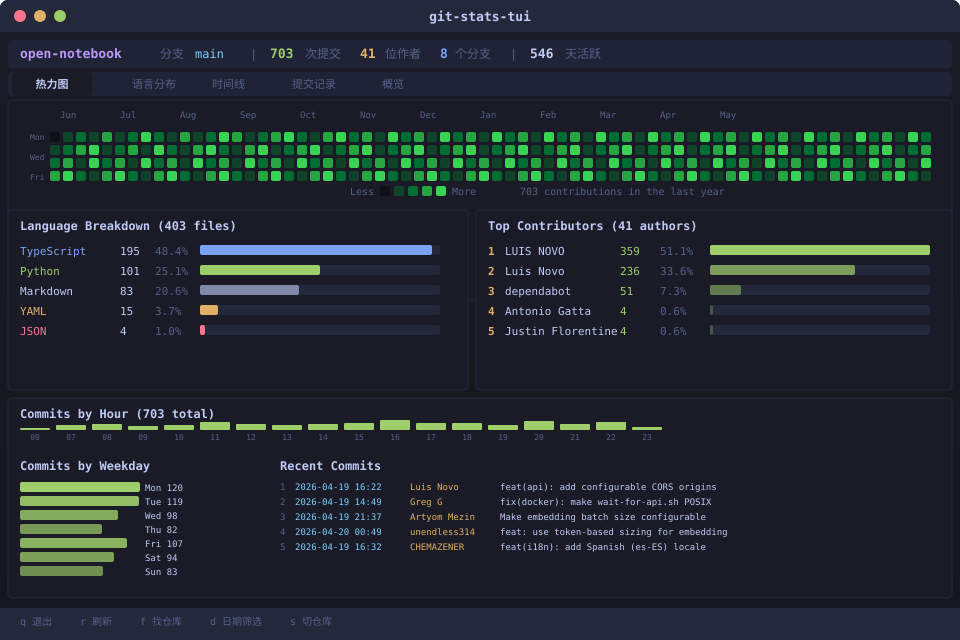

# git-stats-tui

> Beautiful terminal UI for local git statistics — contribution heatmap, language breakdown, commit patterns


> **About the author**: I'm not a professional programmer — just someone who loves building useful tools with the help of AI (Vibe Coding). This project was created entirely through AI-assisted development. If you're also a beginner curious about coding, this repo is proof that you can ship real software too!

---

## Features

- **Contribution Heatmap** — GitHub-style 52-week heatmap, right in your terminal
- **Language Breakdown** — file count by language with colored bar chart
- **Commit Timeline** — commit patterns by hour of day and day of week
- **Top Contributors** — author breakdown with share percentages
- **Recent Commits** — scrollable commit list with insertions/deletions
- **Overview Dashboard** — all key stats at a glance
- **Date Range Filter** — press `d` to filter stats to a date range
- **Repo Switcher** — press `s` to switch to another repo without restarting
- **Keyboard Navigation** — tab between views, `r` to refresh, `q` to quit
- **Zero API Calls** — pure local `.git` parsing, works offline, works with any git host

## Quick Start

```bash
# Install
pip install git-stats-tui

# Run in any git repo
cd your-project
git-stats

# Or point to a specific repo
git-stats /path/to/repo

# Find all git repos under a directory
git-stats --find ~/projects
```

## Screenshots



## Key Bindings

| Key | Action |
|-----|--------|
| `Tab` / `Shift+Tab` | Switch between tabs |
| `r` | Refresh stats |
| `f` | Find repos under current directory |
| `d` | Toggle date range filter (e.g. `2025-01-01 ~ 2025-12-31`) |
| `s` | Switch to another repo (path or `#N` for discovered repo) |
| `q` | Quit |

## Tabs

| Tab | Content |
|-----|---------|
| **Heatmap** | 52-week contribution graph + current streak |
| **Languages** | File count by language with bar chart |
| **Timeline** | Commits by hour, by weekday, top authors |
| **Commits** | Recent commits with date, author, message, +/- lines |
| **Overview** | Summary: total commits, authors, branches, peak hour, weekend ratio |

## How It Works

1. Reads `git log` with `--numstat` for commit history + file changes
2. Reads `git ls-files` for language breakdown by file extension
3. Aggregates into daily/hourly/weekly/author buckets
4. Renders with [Textual](https://textual.textualize.io/) TUI + [Rich](https://rich.readthedocs.io/)

No external API, no network, no token — pure local git.

## Development

```bash
# Clone
git clone https://github.com/shadapang/git-stats-tui.git
cd git-stats-tui

# Install dev dependencies
pip install -e ".[dev]"

# Run
python -m src.app

# Lint
ruff check src/
```

## License

MIT

---

# git-stats-tui (中文说明)

> 在终端里看你的 Git 统计数据 —— 贡献热力图、语言占比、提交规律，一个命令搞定

> **关于作者**：我不是专业程序员，只是一个喜欢用 AI 辅助做工具的爱好者（Vibe Coding）。这个项目完全由 AI 辅助开发完成。如果你也是编程小白，这个仓库就是证明——你也能做出真正能用的软件！

## 功能一览

- **贡献热力图** —— 和 GitHub 一样的 52 周热力图，直接在终端里显示
- **语言占比** —— 按文件类型统计，彩色柱状图展示
- **提交时间线** —— 按小时、按星期几统计提交规律
- **贡献者排行** —— 谁提交最多，占比多少
- **最近提交** —— 可滚动的提交列表，显示增删行数
- **总览仪表盘** —— 所有关键数据一目了然
- **日期范围筛选** —— 按 `d` 键输入日期范围，只看某段时间的统计
- **仓库切换** —— 按 `s` 键切换到另一个仓库，不用退出重启
- **键盘操作** —— Tab 切换页面，`r` 刷新，`q` 退出
- **纯本地运行** —— 不调任何 API，不联网，不传数据，只读你本地的 `.git` 目录

## 快速上手

### 前提条件

- Python 3.11 或以上
- 你的项目已经用 git 管理（有 `.git` 目录）

### 安装和运行

```bash
# 第1步：安装依赖
pip install textual rich

# 第2步：下载项目
git clone https://github.com/shadapang/git-stats-tui.git
cd git-stats-tui

# 第3步：运行！
python -m src.app
```

### 指定仓库运行

```bash
# 看某个仓库的统计
python -m src.app /path/to/your/project

# 查找某个目录下所有 git 仓库
python -m src.app --find ~/projects
```

## 键盘快捷键

| 按键 | 功能 |
|------|------|
| `Tab` / `Shift+Tab` | 切换页面 |
| `r` | 刷新数据 |
| `f` | 查找当前目录下的 git 仓库 |
| `d` | 日期范围筛选（输入如 `2025-01-01 ~ 2025-12-31`） |
| `s` | 切换到其他仓库（输入路径或 `#1` 选已发现的仓库） |
| `q` | 退出 |

## 页面说明

| 页面 | 内容 |
|------|------|
| **Heatmap（热力图）** | 52 周贡献图 + 当前连续提交天数 |
| **Languages（语言）** | 按文件类型统计，柱状图展示 |
| **Timeline（时间线）** | 按小时、按星期几的提交分布 + 贡献者排行 |
| **Commits（提交记录）** | 最近的提交列表，含日期、作者、增删行数 |
| **Overview（总览）** | 汇总：总提交数、作者数、分支数、高峰时段、周末/工作日比 |

## 工作原理

1. 读取 `git log` 获取提交历史和文件变更
2. 读取 `git ls-files` 获取文件列表，按扩展名识别语言
3. 按日/时/周/作者聚合统计
4. 用 [Textual](https://textual.textualize.io/) 渲染终端界面，[Rich](https://rich.readthedocs.io/) 渲染图表

**全程不联网、不调 API、不需要 Token** —— 只读你本地的 git 数据。

## 给编程小白的说明

如果你和我一样不是专业程序员，这里是一些可能有用的提示：

1. **什么是终端/TUI？** 就是那个黑底白字的命令行窗口。TUI = Text User Interface，在终端里画的界面。
2. **什么是 git？** 一个代码版本管理工具。如果你在 GitHub 上有项目，你本地就有 `.git` 目录，这个工具就能读它。
3. **怎么运行？** 打开终端（Windows 按 Win+R 输入 cmd），按上面的"快速上手"步骤操作就行。
4. **出错了怎么办？** 确保你在 git 仓库目录下运行，或者用 `python -m src.app /你的项目路径` 指定路径。

## 许可证

MIT（随便用，随便改，注明出处就行）
